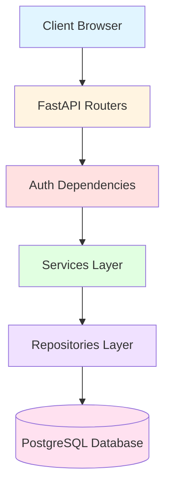
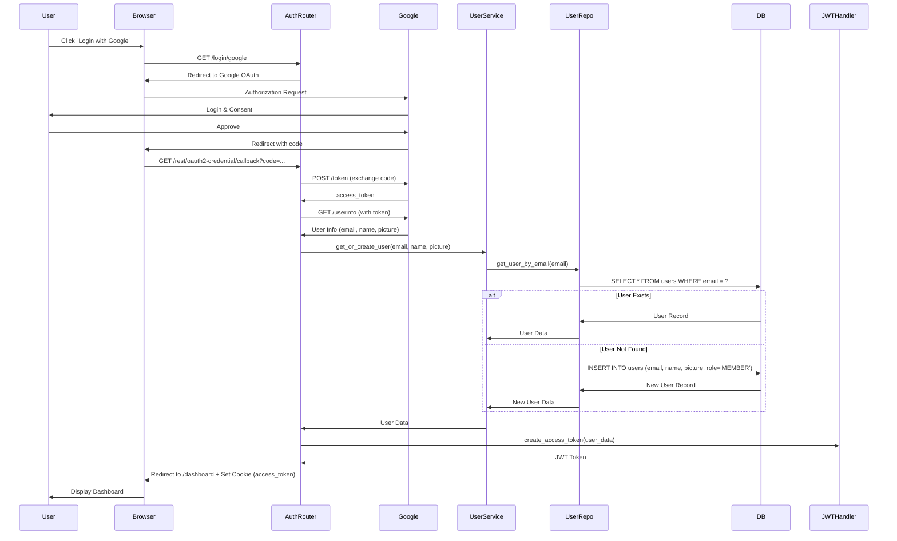
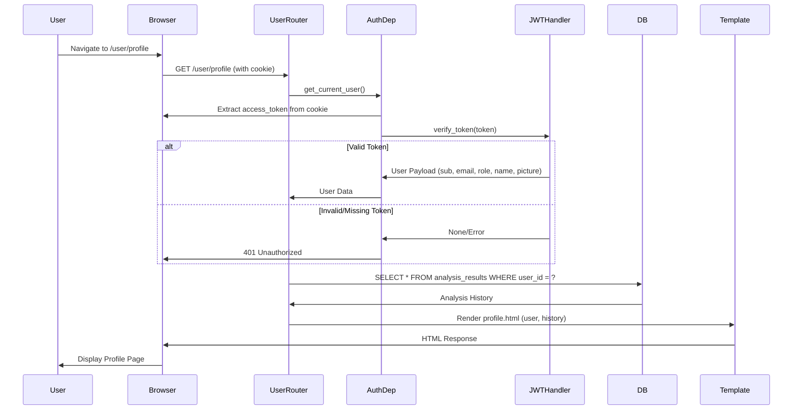
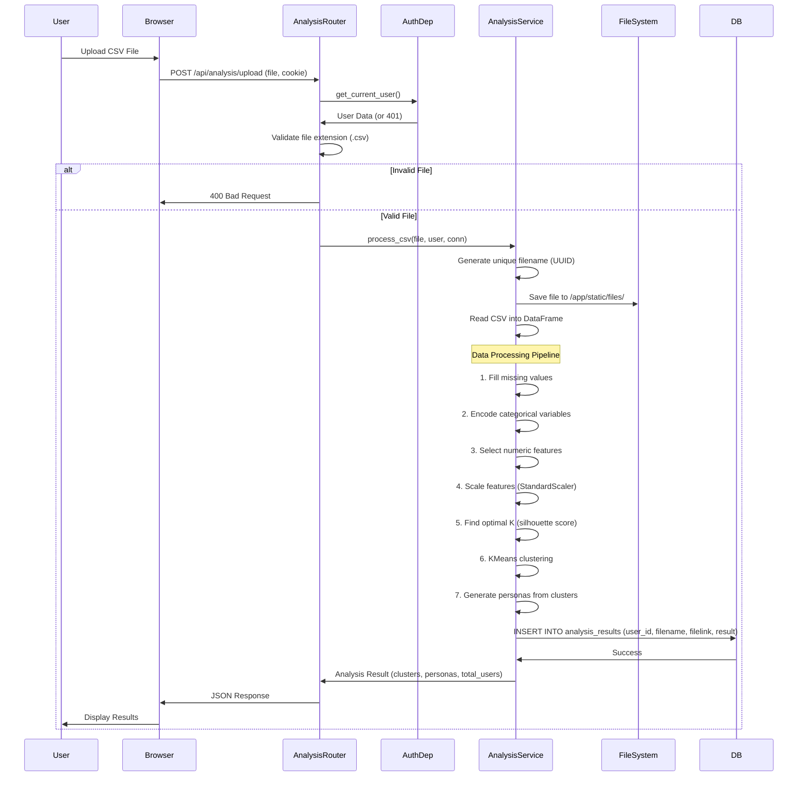
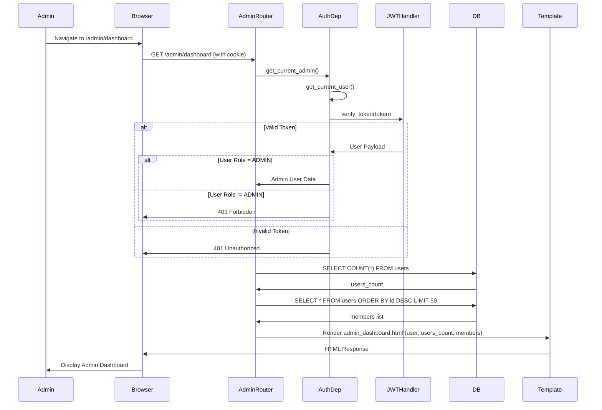
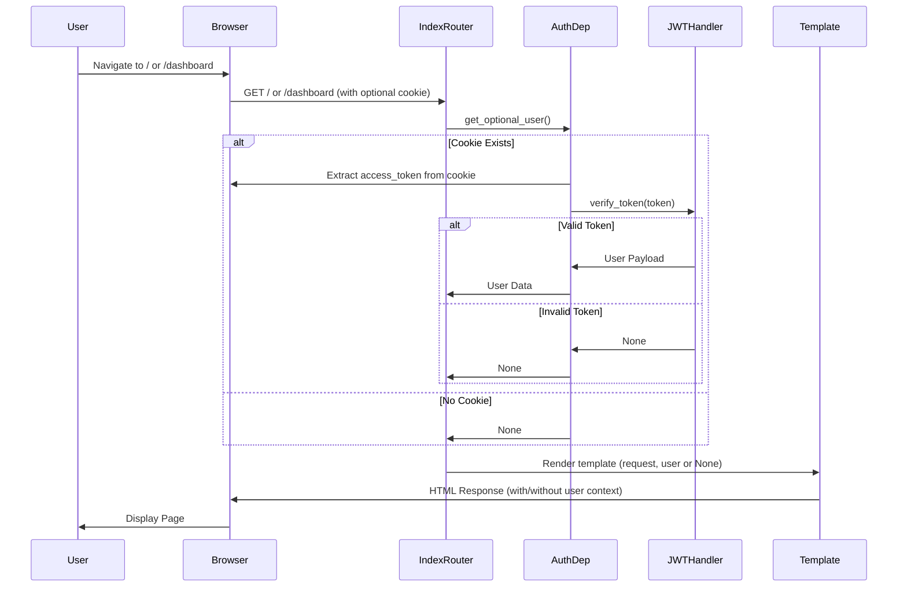
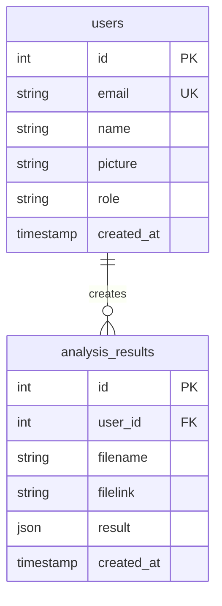

# AI Persona Customer Survey - Code Flow Documentation

This document provides detailed code flow diagrams for each URI and workflow in the application.

## Table of Contents
- [Architecture Overview](#architecture-overview)
- [Authentication Flow](#authentication-flow)
- [User Profile Flow](#user-profile-flow)
- [Analysis Upload Flow](#analysis-upload-flow)
- [Admin Dashboard Flow](#admin-dashboard-flow)
- [Dashboard View Flow](#dashboard-view-flow)

---

## Architecture Overview

---

## Authentication Flow

### URI: `/login/google` → `/rest/oauth2-credential/callback`

**Files Involved:**
- [auth_router.py](file:///apps/project_AI_Persona_CustomerSurvey/app/routers/auth_router.py) - OAuth callback and login endpoints
- [users_service.py](file:///apps/project_AI_Persona_CustomerSurvey/app/services/users_service.py) - User business logic
- [users_repository.py](file:///apps/project_AI_Persona_CustomerSurvey/app/repositories/users_repository.py) - Database operations
- [jwt_handler.py](file:///apps/project_AI_Persona_CustomerSurvey/app/auth/jwt_handler.py) - JWT token creation/verification

---

## User Profile Flow

### URI: `/user/profile`

**Files Involved:**
- [user_router.py](file:///apps/project_AI_Persona_CustomerSurvey/app/routers/user_router.py) - Profile endpoint
- [auth.py](file:///apps/project_AI_Persona_CustomerSurvey/app/dependencies/auth.py) - Authentication dependency
- [db_connection.py](file:///apps/project_AI_Persona_CustomerSurvey/app/dependencies/db_connection.py) - Database connection
- [profile.html](file:///apps/project_AI_Persona_CustomerSurvey/app/templates/profile.html) - Profile template

---

## Analysis Upload Flow

### URI: `/api/analysis/upload`

**Files Involved:**
- [analysis_router.py](file:///apps/project_AI_Persona_CustomerSurvey/app/routers/analysis_router.py) - Upload endpoint
- [analysis_service.py](file:///apps/project_AI_Persona_CustomerSurvey/app/services/analysis_service.py) - ML processing logic
- [auth.py](file:///apps/project_AI_Persona_CustomerSurvey/app/dependencies/auth.py) - Authentication dependency

**Data Processing Steps:**
1. **Preprocessing**: Fill missing values with 0
2. **Encoding**: Convert categorical variables using LabelEncoder
3. **Feature Selection**: Extract numeric features (exclude user_id)
4. **Scaling**: Standardize features using StandardScaler
5. **Clustering**: KMeans with optimal K (3-7 clusters, selected by silhouette score)
6. **Persona Generation**: Create persona profiles from cluster statistics
7. **Persistence**: Save results to database with file link

---

## Admin Dashboard Flow

### URI: `/admin/dashboard`

**Files Involved:**
- [admin_router.py](file:///apps/project_AI_Persona_CustomerSurvey/app/routers/admin_router.py) - Admin dashboard endpoint
- [auth.py](file:///apps/project_AI_Persona_CustomerSurvey/app/dependencies/auth.py) - Admin authentication dependency
- [admin_dashboard.html](file:///apps/project_AI_Persona_CustomerSurvey/app/templates/admin_dashboard.html) - Admin template

**Authorization Levels:**
1. **Authentication Check**: Verify JWT token exists and is valid
2. **Role Check**: Verify user role is 'ADMIN'
3. **Data Access**: Fetch aggregated statistics and user list

---

## Dashboard View Flow

### URI: `/dashboard` and `/`

**Files Involved:**
- [index_router.py](file:///apps/project_AI_Persona_CustomerSurvey/app/routers/index_router.py) - Index and dashboard endpoints
- [auth.py](file:///apps/project_AI_Persona_CustomerSurvey/app/dependencies/auth.py) - Optional authentication
- [index.html](file:///apps/project_AI_Persona_CustomerSurvey/app/templates/index.html) - Landing page template
- [dashboard.html](file:///apps/project_AI_Persona_CustomerSurvey/app/templates/dashboard.html) - Dashboard template

**Note**: These routes use `get_optional_user()` which allows both authenticated and unauthenticated access. The template can conditionally render content based on user presence.

---

## Database Schema

---

## Technology Stack

- **Framework**: FastAPI
- **Database**: PostgreSQL (asyncpg)
- **Authentication**: Google OAuth2 + JWT
- **ML Libraries**: scikit-learn, pandas
- **Template Engine**: Jinja2
- **Clustering**: KMeans with silhouette score optimization

---

## Key Dependencies

### Authentication Flow
- `get_optional_user()`: Returns user or None (for public pages)
- `get_current_user()`: Returns user or raises 401 (for protected pages)
- `get_current_admin()`: Returns admin user or raises 403 (for admin pages)

### Database Connection
- `get_db_connection()`: Provides asyncpg connection with automatic cleanup

### Services
- `UserService`: User management (get or create)
- `AnalysisService`: CSV processing and ML analysis

---

## Environment Variables

Required environment variables (configured in `.env`):
- `GOOGLE_CLIENT_ID`: Google OAuth2 client ID
- `GOOGLE_CLIENT_SECRET`: Google OAuth2 client secret
- `GOOGLE_REDIRECT_URI`: OAuth2 callback URL
- `DB_HOST`: PostgreSQL host
- `DB_PORT`: PostgreSQL port
- `POSTGRES_DB`: Database name
- `POSTGRES_USER`: Database user
- `POSTGRES_PASSWORD`: Database password
- `JWT_SECRET_KEY`: Secret key for JWT signing
- `JWT_ALGORITHM`: JWT algorithm (e.g., HS256)
